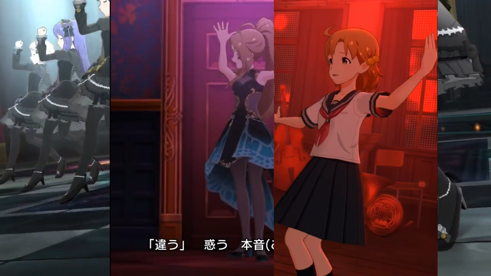

# RollCompare
Avisynth+ Plugin to create mask-rolling ( or mask-scrolling if you prefer ) comparison between videos.

## Usage
```javascript
LoadPlugin("RollCompare_r64.dll")
v1 = DirectShowSource("K:\SAMPLES\kururiuta_720p60.mp4",video=true,audio=true)
v2 = DirectShowSource("K:\SAMPLES\akaisekaikierukoro_720p60.mp4",video=true,audio=false)
v3 = DirectShowSource("K:\SAMPLES\danslobscurite_720p60.mp4",video=true,audio=false)

v1 = ConvertToRGB24(v1)
v2 = ConvertToRGB24(v2)
v3 = ConvertToRGB24(v3)
PSW_RollCompare(v1, "h", 3, v2, v3)

ConvertToYV12(matrix="Rec601", interlaced=false)
```

## Preview


## Filters
- `PSW_RollCompare(Clip clip1, string direction, int speed, Clip ...)` (Only supports RGB24 and RGB32)
  - `Clip clip1` : Main Clip
  - `string direction` : Rolling Direction, valid values :
    - `x`, `h`, `horz` , `horizontal` : Horizontal
    - `y`, `v`, `vert` , `vertical` : Vertical
    - Any other value : Main clip will be returned
  - `int speed` : Rolling speed, measured in pixel per frame
  - `Clip ...` : Additional clips mask-rolled over main clip

## Building
### Pre-requiste
- CMake 3.8
- C++ IDE (I'm using Visual Studio 2019 with integrated CMake module)
- AviSynth+ Filter SDK (I'm using AVS+ 3.7.0, included if you check it during installation)
- .NET Core SDK 2.1 with dotnet scripting for post build script
- git (Optional)

### Compiling
Download the source, via git or via a normal downloader. then extract it.
#### Visual Studio w/ integrated CMake
- From VS2019 Project Selection, Choose Open a local folder, point to the extracted folder.
- Wait for CMake to generate the build source
- Choose configuration, then click `Build > Build all` / `Ctrl + Shift + B`

#### CMake
- Generate build source with:
  - for other generators, see [CMake Generators](https://cmake.org/cmake/help/latest/manual/cmake-generators.7.html)
```batch
cd "path\to\projectroot\RollCompare\"
:::cmake -G [Generators] -A [Win32|x64], example:
cmake -G "Visual Studio 16 2019" -A Win32
```
- Open the generated build source, then compile it the way they provide.

### Built Binaries
If the Post Build Script is ran and successful, the DLL files should be at "RollCompare/bin/RollCompare_xyy.dll"
Otherwise it will be at the default location the generator / compiler creates.

the post-build script file name reflects the configuration and architecture it's built as:
- `RollCompare_d32.dll` - x86-Debug
- `RollCompare_d64.dll` - x64-Debug
- `RollCompare_r32.dll` - x86-Release
- `RollCompare_r64.dll` - x64-Release
Debug binaries can be used to debug using IDE/Debugger of your choice with debuggable program that 
loads AviSynth+ and this plugin such as AvsPmod and other players.

## Issues
The current code requires significant amount of processing power the more video need to
be compared, will be more visible then is done real-time.

## License
Free for Public Use!
